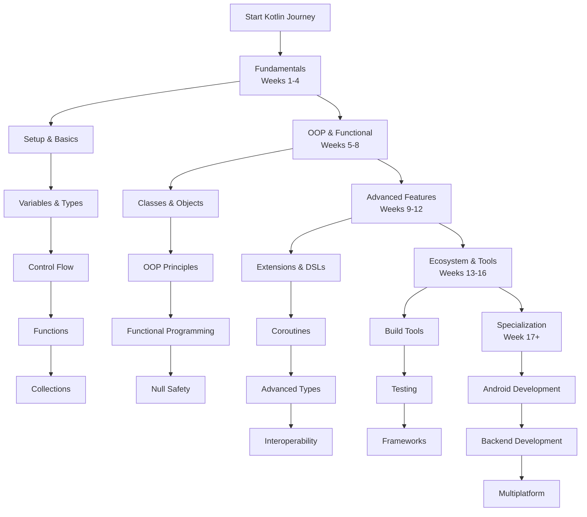

# Kotlin Developer Learning Path: A Structured Curriculum

This comprehensive roadmap provides a structured approach to mastering Kotlin development. The curriculum is designed sequentially, with each module building upon previous knowledge to ensure a solid foundation and progressive skill development.

---

## Phase 1: Kotlin Fundamentals & Syntax (Weeks 1-4)

*   [**Module 1: Introduction & Development Environment**](https://github.com/example/kotlin-intro/#readme)
    *   Kotlin Overview: History, Philosophy, and Key Characteristics (Concise, Safe, Interoperable)
    *   Understanding Kotlin's Relationship with JVM, Android, and JavaScript
    *   Installing Kotlin Compiler and Configuring Development Environment
    *   Setting Up IDEs: IntelliJ IDEA, Android Studio, or VS Code with Kotlin Plugin
    *   Creating, Compiling, and Executing a "Hello World" Application

*   [**Module 2: Basic Syntax & Program Structure**](https://github.com/example/kotlin-syntax/#readme)
    *   Anatomy of a Kotlin Program: `main` Function and Top-level Definitions
    *   Package Declaration and Import Statements
    *   Code Documentation: Comments (`//`, `/* */`) and KDoc (`/** */`)
    *   Understanding Kotlin's Expression-Oriented Nature

*   [**Module 3: Variables and Data Types**](https://github.com/example/kotlin-variables/#readme)
    *   Variable Declaration: `val` (read-only) vs `var` (mutable)
    *   Type Inference and Explicit Type Declarations
    *   Basic Types: Numbers, Booleans, Characters, Strings, Arrays
    *   String Templates and Multi-line Strings
    *   Type Checking and Casting: `is`, `as`, Smart Casts

*   [**Module 4: Control Flow Statements**](https://github.com/example/kotlin-control-flow/#readme)
    *   Conditional Expressions: `if` as Expression, `when` Expression
    *   Looping Constructs: `for`, `while`, `do-while`
    *   Range Expressions and Progression Iteration
    *   Flow Control: `break`, `continue`, and Labels

*   [**Module 5: Functions**](https://github.com/example/kotlin-functions/#readme)
    *   Function Declaration Syntax and Default Arguments
    *   Named Arguments and Variable Number of Arguments (`vararg`)
    *   Single-Expression Functions and Function Scope
    *   Extension Functions and Infix Notation

*   [**Module 6: Collections & Lambdas**](https://github.com/example/kotlin-collections/#readme)
    *   Collection Types: List, Set, Map (Read-only vs Mutable)
    *   Collection Operations: Filtering, Transformation, Aggregation
    *   Lambda Expressions and Higher-Order Functions
    *   Common Standard Library Functions: `let`, `run`, `with`, `apply`, `also`

---

## Phase 2: Object-Oriented & Functional Programming (Weeks 5-8)

*   [**Module 7: Classes and Objects**](https://github.com/example/kotlin-classes/#readme)
    *   Class Declaration: Constructors (Primary and Secondary), Initializer Blocks
    *   Properties: Getters, Setters, Backing Fields, and Custom Accessors
    *   Visibility Modifiers: `public`, `internal`, `protected`, `private`
    *   Data Classes and Destructuring Declarations
    *   Object Declarations and Companion Objects

*   [**Module 8: OOP Principles in Kotlin**](https://github.com/example/kotlin-oop/#readme)
    *   **Inheritance:** `open` Keyword, Method Overriding, and `super` Calls
    *   **Interfaces:** Default Implementations and Interface Delegation
    *   **Abstract Classes** and Sealed Classes for Restricted Hierarchies
    *   **Delegation Pattern:** Using `by` Keyword for Class Delegation

*   [**Module 9: Functional Programming Features**](https://github.com/example/kotlin-functional/#readme)
    *   Higher-Order Functions and Function Types
    *   Lambda Expressions with Receivers
    *   Collection Processing with Functional Operations
    *   Tail Recursive Functions and Sequence Processing

*   [**Module 10: Null Safety & Exception Handling**](https://github.com/example/kotlin-null-safety/#readme)
    *   Nullable Types and Safe Calls (`?.`)
    *   Elvis Operator (`?:`) and Safe Casts (`as?`)
    *   The `!!` Operator and Explicit Null Checks
    *   Exception Handling: `try-catch-finally` as Expression
    *   Custom Exceptions and Checked Exceptions Approach

---

## Phase 3: Advanced Kotlin Features (Weeks 9-12)

*   [**Module 11: Extension Functions & Properties**](https://github.com/example/kotlin-extensions/#readme)
    *   Creating Extension Functions for Existing Types
    *   Extension Properties and Their Limitations
    *   Scope Functions: Understanding Differences Between `let`, `run`, `with`, `apply`, `also`
    *   Practical Use Cases for Each Scope Function

*   [**Module 12: Coroutines & Asynchronous Programming**](https://github.com/example/kotlin-coroutines/#readme)
    *   Introduction to Coroutines: Suspending Functions and Coroutine Builders
    *   Coroutine Context and Dispatchers
    *   Structured Concurrency and Coroutine Scope
    *   Asynchronous Operations: `async/await` Pattern
    *   Flow API for Stream Processing

*   [**Module 13: Generics & Advanced Types**](https://github.com/example/kotlin-generics/#readme)
    *   Generic Classes, Functions, and Constraints
    *   Declaration-site and Use-site Variance (`in`, `out`)
    *   Reified Type Parameters and Star Projections
    *   Type Aliases and Inline Classes

*   [**Module 14: DSLs & Annotation Processing**](https://github.com/example/kotlin-dsl/#readme)
    *   Type-Safe Builder Pattern and DSL Creation
    *   Annotation Declaration and Processing
    *   Reflection API Basics and Practical Applications
    *   Kotlin Scripting and Gradle DSL

*   [**Module 15: Java Interoperability**](https://github.com/example/kotlin-interop/#readme)
    *   Calling Java Code from Kotlin and Vice Versa
    *   Handling Nullability in Java Interop
    *   Property Access and Method Naming Conventions
    *   SAM Conversions and Functional Interface Interop

---

## Phase 4: Kotlin Ecosystem & Development Tools (Weeks 13-16)

*   [**Module 16: Build Tools & Dependency Management**](https://github.com/example/kotlin-build-tools/#readme)
    *   **Gradle Kotlin DSL:** Build Script Configuration
    *   **Maven Integration** for Kotlin Projects
    *   Dependency Management and Plugin Application
    *   Multi-module Project Setup and Configuration

*   [**Module 17: Testing in Kotlin**](https://github.com/example/kotlin-testing/#readme)
    *   Writing Unit Tests with **JUnit 5** and Kotlin
    *   **Kotest** Framework for Property-based Testing
    *   **MockK** Library for Mocking in Kotlin
    *   Coroutine Testing and Asynchronous Test Patterns

*   [**Module 18: Popular Kotlin Frameworks**](https://github.com/example/kotlin-frameworks/#readme)
    *   **Ktor:** Building Asynchronous Web Applications
    *   **Spring Boot with Kotlin:** Enterprise Application Development
    *   **Exposed:** SQL DSL and ORM for Database Operations
    *   **Koin & Dagger:** Dependency Injection in Kotlin

---

## Phase 5: Specialization & Real-World Projects

*   [**Module 19: Android Development with Kotlin**](https://github.com/example/kotlin-android/#readme)
    *   Android Studio Setup and Kotlin Configuration
    *   Modern Android Architecture: ViewModel, LiveData, Room
    *   Coroutines in Android: Background Processing and UI Updates
    *   Jetpack Compose: Declarative UI with Kotlin

*   [**Module 20: Backend Development with Kotlin**](https://github.com/example/kotlin-backend/#readme)
    *   Building RESTful APIs with Ktor or Spring Boot
    *   Database Integration and Data Persistence
    *   Authentication, Authorization, and Security
    *   Deployment and Containerization with Docker

*   [**Module 21: Kotlin Multiplatform**](https://github.com/example/kotlin-multiplatform/#readme)
    *   Shared Business Logic Across Platforms
    *   iOS Integration with Kotlin/Native
    *   Web Development with Kotlin/JS
    *   Building Cross-platform Applications

*   [**Module 22: Capstone Project & Best Practices**](https://github.com/example/kotlin-capstone/#readme)
    *   **End-to-End Application Development**
    *   Code Style Guidelines and Kotlin Idioms
    *   Performance Optimization and Memory Management
    *   **Choose Your Path:**
        *   **Android App Development:** Complete Mobile Application
        *   **Backend Service:** Scalable Web Service or API
        *   **Multiplatform Project:** Cross-platform Application

---

## Learning Resources

*   **Official Documentation:** [Kotlin Lang](https://kotlinlang.org/docs/)
*   **Interactive Learning:** [Kotlin Koans](https://play.kotlinlang.org/koans)
*   **Community:** Kotlin Slack, Reddit, and Stack Overflow
*   **Books:** "Kotlin in Action", "Effective Kotlin"

*Note: Replace `https://github.com/example/` with actual repository links for each module.*
